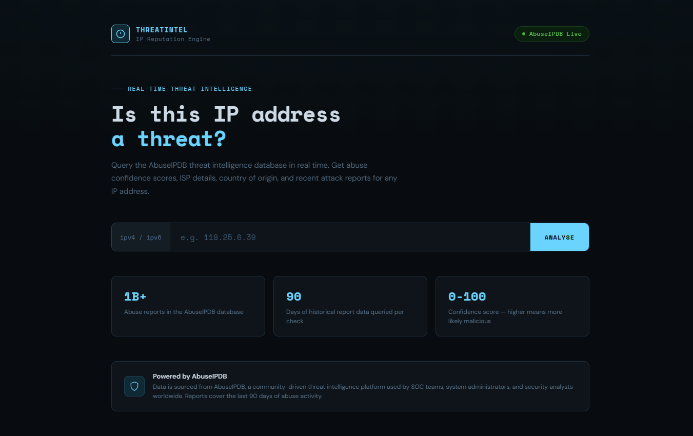
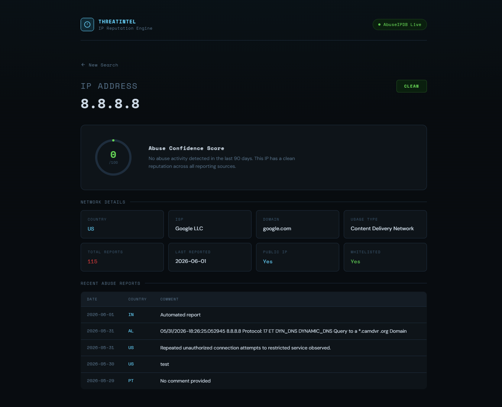
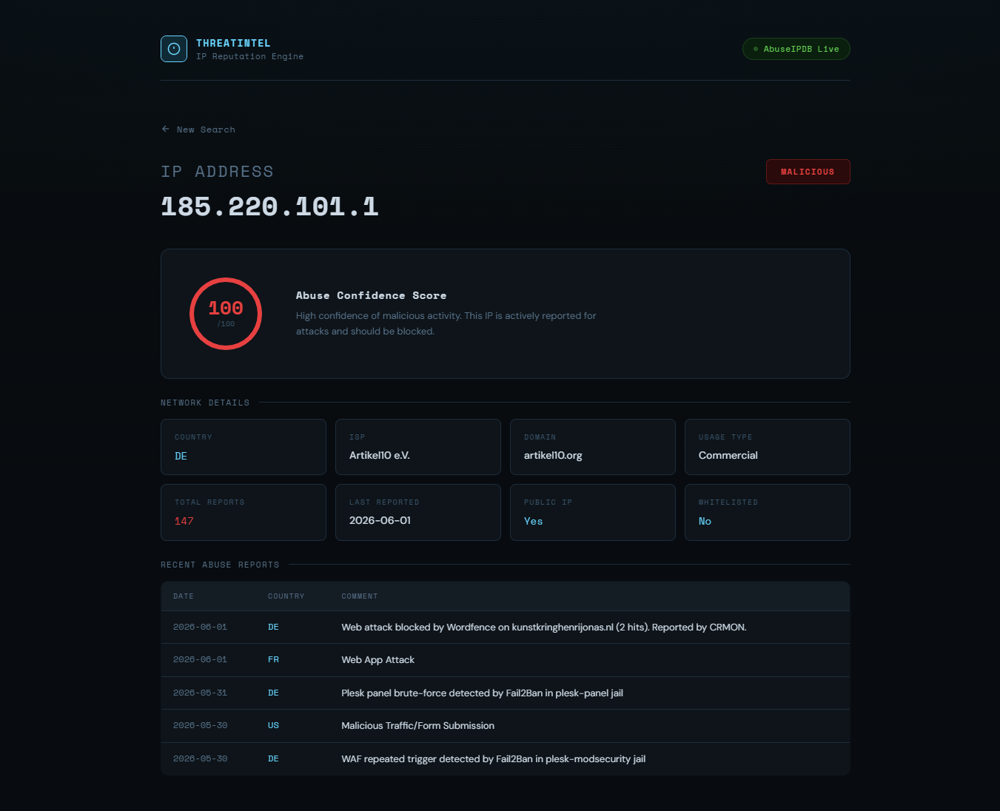

# Threat Intelligence Dashboard

A live web application for checking IP address reputation against real-world threat intelligence data. Built with Python and Flask, deployed on Render.

**Live:** https://threat-intel-dashboard-cya6.onrender.com

---

## What It Does

Enter any IP address and get an instant threat report powered by the AbuseIPDB database, the same source used by SOC teams and security analysts worldwide.

Each result shows:

- Abuse confidence score (0-100)
- Risk verdict: Clean, Low Risk, Suspicious, or Malicious
- Country, ISP, domain, and usage type
- Total abuse reports and last reported date
- Up to 5 recent abuse reports with dates and comments

---

## How to Use

Visit the live URL above, enter any IPv4 or IPv6 address into the search bar, and click Analyse. Results are returned in seconds.

Some IPs to try:

- `8.8.8.8` - Google DNS, expect Clean
- `1.1.1.1` - Cloudflare DNS, expect Clean
- `185.220.101.1` - Tor exit node, expect Malicious

---

## Example Usage

The two examples below show the comparison results of clean and malicious

---

## Stack

Python, Flask, AbuseIPDB API v2, Jinja2, deployed on Render
